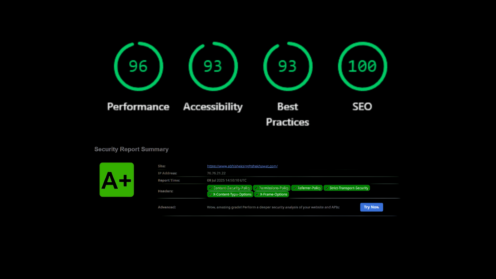
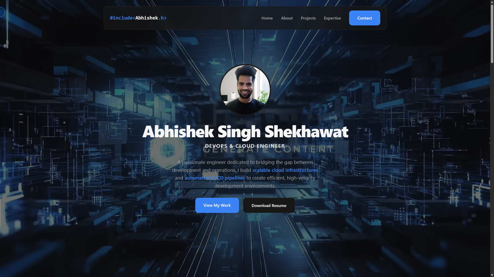

# Portfolio V3 - Abhishek Singh Shekhawat

[

This repository contains the source code for my personal portfolio and professional platform, available at **[www.abhisheksinghshekhawat.com](https://www.abhisheksinghshekhawat.com/)**.

This project was engineered from the ground up not just as a static page, but as a comprehensive platform to showcase my skills in full-stack development, DevOps, and cloud engineering. It was built with a "product mindset," focusing on elite performance, robust security, and a premium user experience.

---

## Key Features

*   **Multi-Page Architecture:** A full-featured site including a homepage, about section, detailed project showcases, an expertise breakdown, and a tech blog.
*   **Serverless Backend:** Utilizes a cost-effective and scalable serverless architecture (Google App Script & Google Sheets) to handle contact forms, contributor applications, and gated gallery access.
*   **Contribution Platform:** An integrated system allowing other aspiring developers to apply to collaborate on real-world projects, fostering a community of learners.
*   **Gated Content:** A secure, login-protected private gallery for exclusive content.

---

## Technical Architecture & Engineering Excellence

This project was built with a focus on modern web standards and professional engineering practices.

### Performance & Security

The platform is engineered for speed and security, achieving top-tier audit scores:
*   **Hosting:** Deployed on **Vercel's Global Edge Network** for low-latency content delivery worldwide.
*   **Performance:** Achieves a **100/96 Lighthouse score**, ensuring a fast and responsive user experience.
*   **Security:** Hardened with a strict Content Security Policy (CSP) and server-level headers, earning an **A+ grade** from Security Headers by Mozilla.
*   **SEO:** Built with comprehensive structured data (JSON-LD) and metadata for optimal search engine visibility.

---

## Tech Stack

This project leverages a modern and diverse technology stack to deliver a complete front-to-back experience.

| Category | Technologies |
| :--- | :--- |
| **Frontend** | HTML5, CSS3 (with variables), JavaScript (ES6+), Inter Font |
| **Backend (Serverless)** | Google App Script (as API), Google Sheets (as Database) |
| **Deployment & DevOps** | Vercel, Git, GitHub, CI/CD |
| **Security** | Content Security Policy (CSP), `vercel.json` Custom Headers |
| **SEO & Analytics** | JSON-LD Schema, Open Graph, Vercel Analytics |
| **Design & Tooling**| Figma, Google AI Studio (for code refactoring), VS Code |

---

## Development & Testing Phases

The creation of this platform followed a structured, multi-phase engineering lifecycle:

*   **Phase 1: Development & Prototyping**
    *   Ideation, UI/UX design in Figma, and initial code generation.
    *   Development of all frontend pages and interactive components.
    *   Implementation of the serverless backend for all form handling and the gallery authentication system.

*   **Phase 2: Optimization & Hardening**
    *   Implementation of "Fortress-Level" security with a comprehensive CSP and secure headers.
    *   Advanced SEO implementation with structured data and rich social sharing cards.
    *   Full minification of all HTML, CSS, and JS assets.
    *   UI polish with modern fonts and refined component styling.

*   **Phase 3: God-Level Testing**
    *   Automated audits using Lighthouse and Security Headers scanners.
    *   Rigorous manual testing across multiple browsers (Chrome, Firefox, Edge) and devices.
    *   Functional testing of all links, forms, and user flows.
    *   Resolution of all identified bugs and layout inconsistencies.

*   **Phase 4: Deployment**
    *   Migration from GitHub Pages to a high-performance Vercel deployment.
    *   Configuration of `vercel.json` to enforce server-level security headers.
    *   Connection and configuration of the custom domain.

*   **Phase 5: Launch**
    *   Final professional launch across social channels (LinkedIn, GitHub).

---

Thank you for visiting. I invite you to explore the live site and connect with me.

**[Explore the live platform ->](https://www.abhisheksinghshekhawat.com/)**
